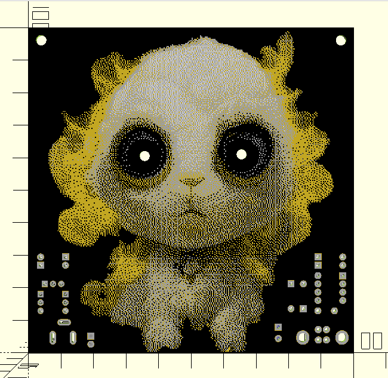

# STEM4ukraine-Bavovna

A simple PCB with the official bavovna mascot

The circuit produces a heartbeat pulse for the pair of glowing eyes!

A fun school STEM project demonstrating simple through hole soldering and analogue electronics using USB power to drive the 555 timer based analogue circuit.

The prototype is currently undergoing manufacturing and testing

An openscad render of the front of the PCB:

The Bavovna schematic:

